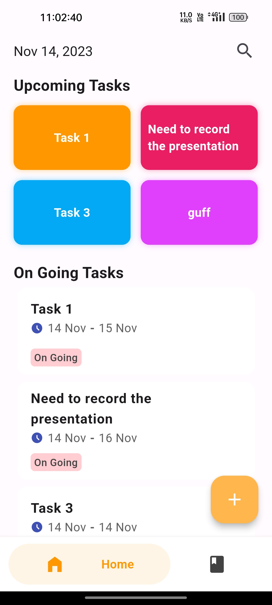
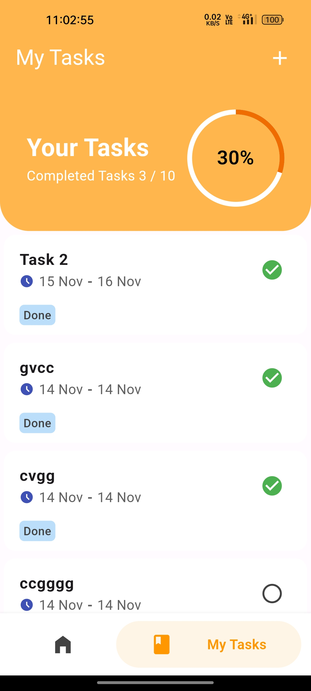
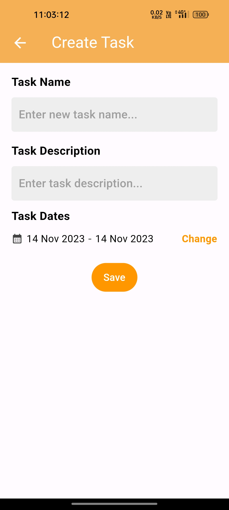

# task_app_flutter

Get `YOUR_API_KEY` from the google cloud console for the Google Calender API

A new Flutter project.

### APP User Interface
<table>
       <tr>
       <td align="center">Home Page</td>
       <td align="center">My Tasks Page</td>
       <td align="center">Create Task Page</td>
      </tr>
       <tr>
       <td></td>
       <td></td>
       <td></td>
      </tr>
</table>

## Getting Started

This project is a starting point for a Flutter application.

A few resources to get you started if this is your first Flutter project:

- [Lab: Write your first Flutter app](https://docs.flutter.dev/get-started/codelab)
- [Cookbook: Useful Flutter samples](https://docs.flutter.dev/cookbook)

For help getting started with Flutter development, view the
[online documentation](https://docs.flutter.dev/), which offers tutorials,
samples, guidance on mobile development, and a full API reference.
